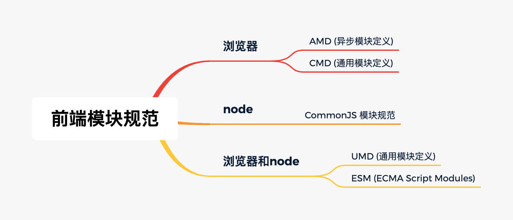

#### 模块化要解决的问题：

- 加载顺序
- 污染全局

#### 实现方式：
- es5实现，用立即执行函数 + 闭包
- commonjs `module.exports`
    - node, 用webpack打包
- AMD `require.js` 
- CMD `sea.js`
- UMD `module.exports` || `AMD` || `window或global`
- ES6模块化，`import` `export`


#### ES5实现
>原生用立即执行函数+闭包

#### commonjs
特点：
- 同步的
- 只要引用就创建一个模块实例，实例化
- 缓存机制： 引入一次就缓存，如果没改变还是用上次的缓存

具体实现：
- node, 用webpack打包

node的`require`并不是全局变量，本质上是下面这样

```
(function (exports, require, module, __filename, __dirname) {
  // 模块源码
});
```
[require() 源码解读](http://www.ruanyifeng.com/blog/2015/05/require.html)

[Javascript模块化编程（三）：require.js的用法](http://www.ruanyifeng.com/blog/2012/11/require_js.html)

用node的debug模式可以看到

##### AMD
>AMD 即Asynchronous Module Definition,中文名是“异步模块定义”的意思。它是一个在浏览器端模块化开发的规范,服务器端的规范是CommonJS。相当于客户端的commonjs。

特点：
- 依赖前置
```
define(moduleName, [module], fatory); 定义模块

require([module],callback); 引入模块
```

##### CMD
> CMD(Common Module Definition) 通用模块定义

特点：
- 依赖就近
- 按需加载

```
define(funtion(require, exports, module) 定义模块

seajs.use(['module路径'], function(moduleA, moduleB, moduleC){})
```

##### UMD
>UMD（Universal Module Definition - 通用模块定义）
AMD是浏览器优先，异步加载；CommonJS是服务器优先，同步加载。
1. 先判断是否支持Node.js模块格式（exports是否存在），存在则使用Node.js模块格式。
2. 再判断是否支持AMD（define是否存在），存在则使用AMD方式加载模块。
3. 前两个都不存在，则将模块公开到全局（window或global)

参考vue.js和jquery.js的写法
```js
// vue.js 2.6.12
(function (global, factory) {
  typeof exports === 'object' && typeof module !== 'undefined' ? module.exports = factory() :
  typeof define === 'function' && define.amd ? define(factory) :
  (global = global || self, global.Vue = factory());
}(this, function () {

  // 一堆vue的逻辑，最后返回Vue构造函数
  
  return Vue;
}));
```

```js
// jquery.js  1.10.0 (不同版本写法不太一样，大致也是做了上面3个判断)
(function(window, undefined) {

    // 一堆jQuery的定义，最后返回jQuery对象
    
    if (typeof module === "object" && typeof module.exports === "object") {
        module.exports = jQuery;
    } else {
        window.jQuery = window.$ = jQuery;
        if (typeof define === "function" && define.amd) {
            define("jquery", [], function() {
                return jQuery;
            });
        }
    }

})(window);
```

[前端模块化：CommonJS,AMD,CMD,ES6](https://juejin.im/post/6844903576309858318#heading-2)

[代码demo地址](https://github.com/sakz/learnJsModule)

[参考的webpack的配置](https://juejin.im/post/6844903802189905934#heading-8)

[b站视频](https://www.bilibili.com/video/BV1K54y1S7zx)

[umd-learning](https://github.com/cumt-robin/umd-learning)

[UMD](https://leohxj.gitbooks.io/front-end-database/content/javascript-modules/about-umd.html)


#### ES6 模块与 CommonJS 模块的差异

##### 1. CommonJS 模块输出的是一个值的拷贝，ES6 模块输出的是值的引用。

- CommonJS 模块输出的是值的拷贝，也就是说，一旦输出一个值，模块内部的变化就影响不到这个值。

- ES6 模块的运行机制与 CommonJS 不一样。JS 引擎对脚本静态分析的时候，遇到模块加载命令import，就会生成一个只读引用。等到脚本真正执行时，再根据这个只读引用，到被加载的那个模块里面去取值。换句话说，ES6 的import有点像 Unix 系统的“符号连接”，原始值变了，import加载的值也会跟着变。因此，ES6 模块是动态引用，并且不会缓存值，模块里面的变量绑定其所在的模块。

##### 2. CommonJS 模块是运行时加载，ES6 模块是编译时输出接口。


- 运行时加载: CommonJS 模块就是对象；即在输入时是先加载整个模块，生成一个对象，然后再从这个对象上面读取方法，这种加载称为“运行时加载”。


- 编译时加载: ES6 模块不是对象，而是通过 export 命令显式指定输出的代码，import时采用静态命令的形式。即在import时可以指定加载某个输出值，而不是加载整个模块，这种加载称为“编译时加载”。


>CommonJS 加载的是一个对象（即module.exports属性），该对象只有在脚本运行完才会生成。而 ES6 模块不是对象，它的对外接口只是一种静态定义，在代码静态解析阶段就会生成。
